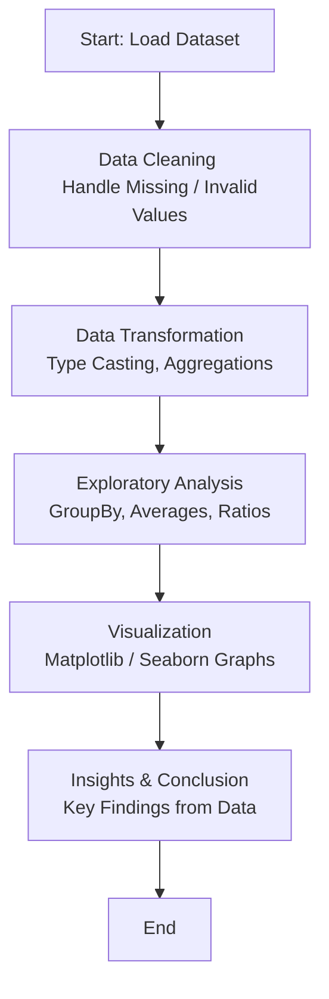

# Report: Voter Information Analysis using PySpark

### Repository Status

| Stars | Forks | Watchers | Languages |
| :---: | :---: | :---: | :---: |
| 1 | 0 | 0 | Jupyter Notebook (100.0%) |

<br>

## Project Overview

This repository contains a **Big Data Analytics Project** focused on analyzing Indian **Voter Information** using **PySpark**.  
It explores the distribution of electors, voters, polling percentages, gender participation, and voting outcomes across various states using both **analytical operations** and **data visualizations**.

| # | Project Folder Name | Description |
| - | -------------------- | ------------ |
| 1 | `10_Voters_Information_Analysis` | A comprehensive PySpark-based project that processes, analyzes, and visualizes the Indian voter dataset. |

---

## Technology Stack

* **Language**: Python 3.x  
* **Core Frameworks**: Apache PySpark, Pandas, Matplotlib, Seaborn  
* **Notebook Environment**: Jupyter Notebook / JupyterLab  
* **Data Format**: CSV (`10_Voters_Information_4.csv`)

---

## Dataset Overview

**File Name:** `10_Voters_Information_4.csv`

| Column Name | Description |
|--------------|-------------|
| State Name | Name of the Indian state |
| Constituency Type | Type of constituency (General, SC, ST) |
| No Of Seats | Number of assembly or parliamentary seats |
| Electors - Male | Count of registered male electors |
| Electors - Female | Count of registered female electors |
| Electors - Third Gender | Count of third gender electors |
| Electors - Total | Total number of electors |
| Electors - NRIs | Total NRI electors |
| Electors - Service | Electors in service (armed forces, etc.) |
| Voters - Male | Total male voters |
| Voters - Female | Total female voters |
| Voters - Third Gender | Total third gender voters |
| Voters - Postal | Total postal votes |
| Voters - Total | Total votes cast |
| Voters - NRIs | Total NRI voters |
| Voters - Poll % | Percentage of polling turnout |
| Rejected Votes (Postal) | Rejected postal votes |
| Evm Rejected Votes | Rejected EVM votes |
| NOTA Votes | Votes cast for “None of the Above” |
| Valid Votes Polled | Total valid votes cast |
| Tendered Votes | Tendered votes recorded |

---

## Visual Analysis Performed

| Visualization | Description |
|----------------|-------------|
| **Total Electors vs Total Voters by State** | Compares the number of registered electors with actual voters. |
| **Average Poll % by State** | Highlights states with high or low voter turnout. |
| **Gender-wise Electors Distribution** | Displays male vs female elector counts. |
| **Gender-wise Voters Distribution** | Shows gender-wise voter participation. |
| **Constituency Type Distribution** | Illustrates the proportion of General, SC, and ST constituencies. |
| **Voters vs Valid Votes Polled** | Shows relationship between total voters and valid votes. |
| **Total NOTA Votes by State** | Identifies states with higher NOTA voting trends. |
| **Rejected Votes by State (Postal & EVM)** | Visualizes rejected votes across states. |
| **Distribution of Poll Percentages** | Examines overall distribution of poll % across states. |
| **Correlation Heatmap** | Displays correlations among numerical columns such as electors, voters, and valid votes. |

---

## Getting Started

### Prerequisites

Ensure your system has the following installed:

* **Python 3.x**
* **Apache Spark**
* **Java Development Kit (JDK)** – version 8, 11, 17, or 21
* **Jupyter Notebook** or **JupyterLab**

### Installation & Setup

1. **Clone the repository:**
   ```bash
   git clone https://github.com/<your-username>/Voter_Information_Analysis.git
  

2. **Navigate to the project directory:**

   ```bash
   cd Voter_Information_Analysis
   ```

3. **Install required Python packages:**

   ```bash
   pip install pyspark pandas matplotlib seaborn
   ```

4. **Launch Jupyter Notebook:**

   ```bash
   jupyter notebook
   ```

5. **Run the notebook:**
   Open the file `Voter_Data_Analysis_PySpark.ipynb` and execute the cells sequentially to perform the analysis.

---

## Workflow Flowchart

Below is a generic **data analytics workflow** followed in this project.



---

## Key Insights

1. **Voter Participation:**

   * Significant variation in polling percentages across states.
   * Some states consistently outperform others in voter turnout.

2. **Gender Analysis:**

   * Male voters slightly outnumber female voters.
   * States with higher female participation show better overall poll percentages.

3. **NOTA & Rejected Votes:**

   * High NOTA counts indicate growing voter awareness or dissatisfaction.
   * Minimal rejected votes show good electoral integrity.

4. **Correlation Patterns:**

   * Strong correlation between **Electors**, **Voters**, and **Valid Votes**.
   * Indicates effective conversion of electors into active voters.

---

## Future Enhancements

* Analyze **multi-year trends** to observe voter behavior changes over time.
* Integrate **geospatial mapping** for interactive visualization.
* Build **predictive models** for turnout forecasting.
* Study **socio-economic correlations** influencing voting patterns.

---


